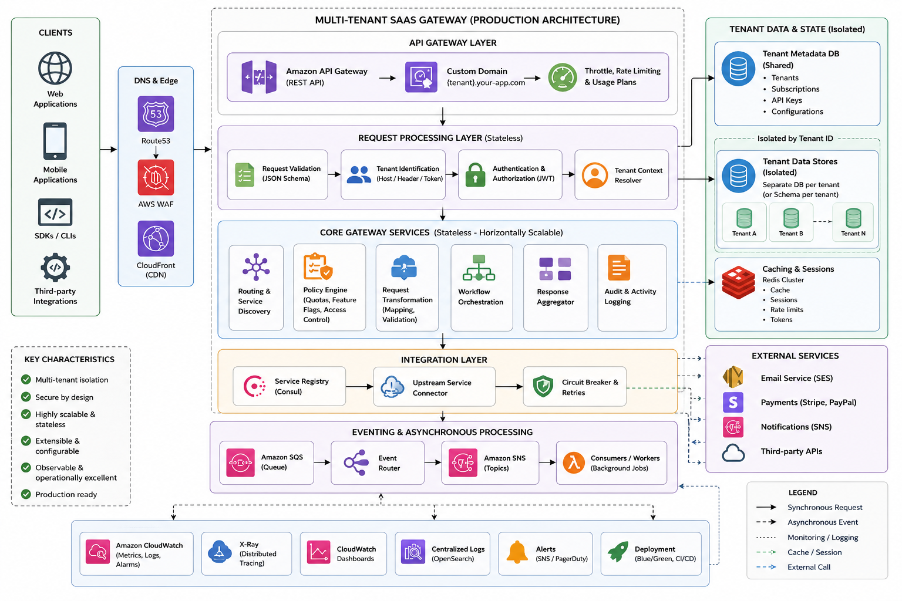

## Multi-Tenant SaaS Gateway

A production-grade, enterprise-scale **Multi-Tenant SaaS Gateway** built with **NestJS**, featuring advanced API management, real-time analytics, multi-tenancy isolation, and comprehensive compliance capabilities.

### Key Features

✅ **Multi-Tenancy** - Complete tenant isolation at all layers (database, cache, events)  
✅ **Enterprise-Grade API Gateway** - Kong integration, request routing, authentication  
✅ **Real-time Analytics** - Prometheus + TimescaleDB + Grafana dashboards  
✅ **Rate Limiting** - Per-tenant and per-user rate limiting with Redis  
✅ **Event Streaming** - Apache Kafka for audit logs and async processing  
✅ **Monitoring & Observability** - Comprehensive metrics collection and alerting  
✅ **RBAC** - Role-Based Access Control with PostgreSQL  
✅ **Kubernetes Ready** - Docker & Kubernetes manifests included  
✅ **Conventional Commits** - Husky hooks, commitlint, lint-staged  
✅ **High Availability** - No single point of failure, auto-scaling ready  

## Quick Start


### Installation

```bash
git clone <repo-url>
cd multi-tenant-saas-gateway

npm install

cp .env.example .env.development.local

# Start services (PostgreSQL, Redis, Kafka, Prometheus, Grafana)
npm run docker:up

npm run start:dev
```

Application will be available at `http://localhost:3000`

## Available Scripts

### Development

```bash
npm run start:dev          
npm run start:debug       
npm run format             
npm run lint               
npm run commit             
```

### Docker

```bash
npm run docker:up         
npm run docker:down      
npm run docker:logs        
```

### Production

```bash
npm run build             
npm run start:prod       
```


## Architecture

<p align="center">
  
</p>

## Services

| Service | Port | Purpose |
|---------|------|---------|
| NestJS App | 3000 | Main API application |
| PostgreSQL | 5432 | Primary application database |
| Redis | 6379 | Caching & rate limiting |
| Kafka | 9092 | Event streaming |
| Prometheus | 9090 | Metrics collection |
| Grafana | 3001 | Dashboards & monitoring |

## Database

### Initialization

The database is automatically initialized when PostgreSQL container starts. Schema includes:

- **Tenants**: Multi-tenant isolation
- **Users**: User accounts with RBAC
- **Roles**: Role-based access control
- **API Keys**: API authentication keys
- **Metrics** (TimescaleDB): Request metrics & analytics
- **Audit Logs** (TimescaleDB): Compliance & audit trail

## Monitoring

### Prometheus
- Dashboard: `http://localhost:9090`
- Query language: PromQL
- Scrape interval: 15s

### Grafana
- Dashboard: `http://localhost:3001`
- Default credentials: admin/admin (Change in production!)
- Pre-configured data source: Prometheus

### Metrics

Key metrics collected:
- Request latency (p50, p95, p99)
- Error rates by tenant
- Gateway throughput
- Resource usage (CPU, memory)
- Database performance
- Rate limit hits

### AWS Infrastructure (Terraform)

Deploy complete AWS infrastructure with Terraform:

```bash
cd infrastructure/
terraform init
terraform plan
terraform apply
```

See [infrastructure/README.md](infrastructure/README.md) for detailed instructions.

**Creates:**
- VPC with public/private subnets
- EKS Kubernetes cluster
- RDS PostgreSQL database
- ElastiCache Redis cluster
- Security groups and IAM roles

### Kubernetes Deployment

Deploy to EKS cluster:

```bash
# Configure kubectl
aws eks update-kubeconfig --region us-east-1 --name saas-gateway-eks

# Create secrets
kubectl create secret generic db-secret \
  --from-literal=username=gateway_user \
  --from-literal=password=your-password \
  -n saas-gateway

# Deploy
kubectl apply -f k8s/
```


## Resources

- [NestJS Documentation](https://docs.nestjs.com)
- [TypeScript Handbook](https://www.typescriptlang.org/docs/)
- [PostgreSQL Documentation](https://www.postgresql.org/docs/)
- [Conventional Commits](https://www.conventionalcommits.org/)
- [Docker Documentation](https://docs.docker.com/)
- [Kubernetes Documentation](https://kubernetes.io/docs/)


